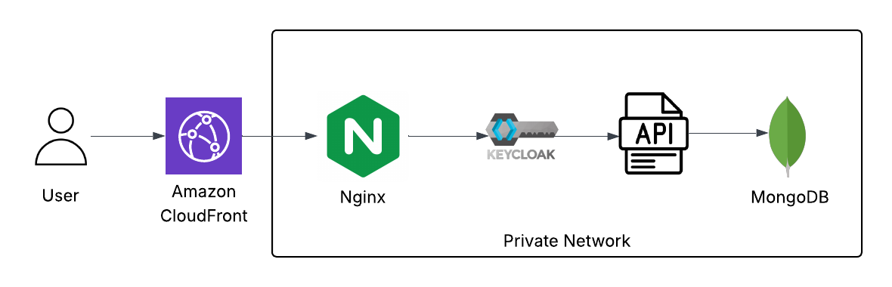
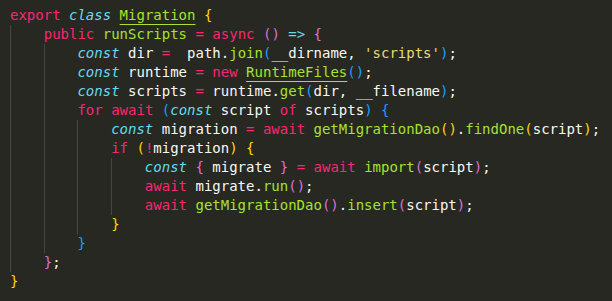
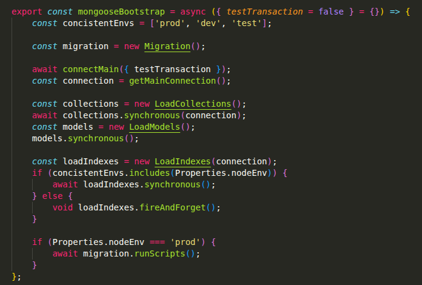
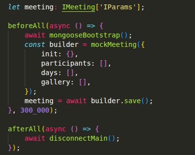
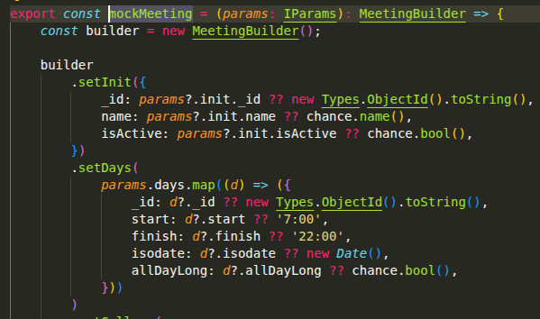
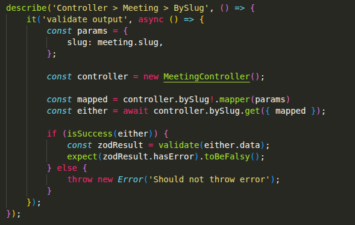
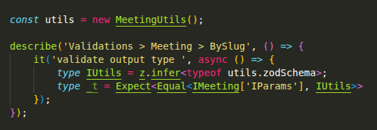
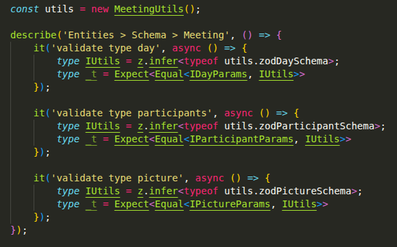

<picture>
  
</picture>

## Architecture decisions
- containerized services. 
- `keycloak` (manage user authentication, registration and sessions).
- `API` protected by authentication middleware. 
- `DB` only accessable via service. 
- `nginx` redirects domain access to internal services. 
- dockerfiles supports three environments: `local`, `development`, and `production`. 
- frontends are provisioned by `cloudfront`. 
- special `admin` frontend for easy UI management. 
- `monorepo` sharing dependencies between multiple modules.

 

## Development environment
- the development environment uses a mock domain (`nanithefuck.local`) and supports flexible service execution: each service can run either inside a Docker container or as a local process while still maintaining full communication between components. **Obs: must be config on local machine DNS**

 

## Keycloak as Identity and Access Management (IAM)
- centralized authentication and session management.
- easy implementation for SSO and external identity providers (Google, Github, ...etc).
- division between (roles, groups, permissions, ..etc)
- each service is a client with custom permissions.
- frontend user login, registration and authentication is manage by keycloak.

 

## API - backend

Each endpoint is protected by <strong>keycloak</strong> auth middleware.

  

    <h3>Migration run scripts</h3>
  

    

      When project is loaded, migrations scripts are runned one by one in order.
      It will skip the scripts already loaded on the <strong>collection migrations</strong>.
      This way we make sure it wont run the same script twice.
    

  

  

    <h3>Project lifecycle control</h3>
    

      <strong>Non blocking dependencies loading</strong> for local environment and <strong>blocking promises</strong> for production environment.
    

  

    

      Routes, mongoDB collections and indexes will load different depends on the environment.
      We don't want blocking when using local environment to slow developer productive process.
      But in production we want to make sure every thing was loaded correctly.
    

  

  

    <h3>Query test strategy</h3>
    

      <strong>In-memory MongoDB instances</strong> for realistic query testing.
    

  

  

    Each test suite runs against an in-memory database to avoid external dependencies while preserving real query behavior.
  

  

  

    <h3>Test with fake entities</h3>
    

      <strong>Customizable mock entities</strong> for precise scenario control.
    

  

  

    Entities are generated through flexible mock factories using fake data, with the ability to override specific fields when needed. This makes it easy to reproduce edge cases and focus tests only on relevant attributes.
  

  

  

    <h3>Test entites validation</h3>
  

  

    Entities are generated through flexible mock factories using fake data, with the ability to override specific fields when needed. This makes it easy to reproduce edge cases and focus tests only on relevant attributes.
  

  

  

    <h3>Test endpoint’s input and output</h3>
  

  

    Tests validate each endpoint’s input and output using Zod schemas, and then assert that the declared TypeScript types are compatible with the runtime data structure. This is important because TypeScript types and actual runtime values are fundamentally different, and both need to be verified. 
  

  

  

    Assert zod type infer against controller params output type at compile time.
  

  

  

    <h3>Test entities object structure</h3>
  

  

    Make sure zod schema is equal to entity structure type. This way we know zod validation is trustful.
  

  

 

## Monorepo
A monorepo was chosen to enable shared packages across multiple projects, making it easier to keep entity structures and types synchronized.

This setup is a key enabler for migrating legacy systems. It allows legacy and modern codebases to coexist within the same repository, while sharing common entities and contracts. 

As a result, the system supports incremental or partial migration, where parts of the legacy code can be progressively replaced without breaking compatibility. Shared contracts ensure both old and new implementations remain aligned during the transition, reducing integration risk and improving long-term maintainability. 

 

See more:  
[Monorepo: The Missing Piece for a Successful Legacy Backend Migration to V2 (Node.js - Tsc)](monorepo.md)